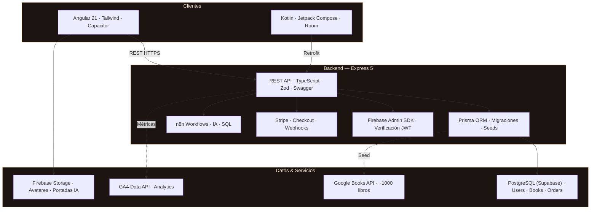

<div align="center">


<br/>

<picture>
  <source media="(prefers-color-scheme: dark)" srcset="https://readme-typing-svg.demolab.com?font=EB+Garamond&weight=500&size=24&duration=3500&pause=800&color=E8C9A0&center=true&vCenter=true&repeat=true&width=720&height=50&lines=%F0%9F%93%9A+Plataforma+de+compra+y+trueque+de+libros;%E2%9A%A1+Angular+21+%C2%B7+Kotlin+%C2%B7+Express+5+%C2%B7+PostgreSQL;%F0%9F%94%A5+Firebase+Auth+%C2%B7+Stripe+Payments+%C2%B7+Capacitor;%F0%9F%93%96+Tu+pr%C3%B3ximo+libro+te+est%C3%A1+buscando">
  
</picture>

<br/><br/>

<a href="https://github.com/Sergiibut05/BookMatch-Proyecto-Intermodular">
  
</a>
&nbsp;
<a href="https://github.com/SamuelMarquezRuiz/BookMatch-Android">
  
</a>
&nbsp;

&nbsp;


<br/><br/>


</div>

<br/>

---

## Índice de contenidos

1. [¿Qué es BookMatch?](#qué-es-bookmatch)
2. [Equipo de desarrollo](#equipo-de-desarrollo)
3. [Funcionalidades](#funcionalidades)
4. [Tech Stack](#tech-stack)
5. [Arquitectura](#arquitectura)
6. [Repositorios de código](#repositorios-de-código)
7. [Artefacto en producción](#artefacto-en-producción)
8. [Aportación del proyecto por módulo](#aportación-del-proyecto-por-módulo)
   - [Acceso a datos — Juan Antonio García Gómez](#acceso-a-datos--juan-antonio-garcía-gómez)
   - [Programación multimedia y dispositivos móviles — David Hormigo Ramírez](#programación-multimedia-y-dispositivos-móviles--david-hormigo-ramírez)
   - [Programación de servicios y procesos — David Hormigo Ramírez](#programación-de-servicios-y-procesos--david-hormigo-ramírez)
   - [Desarrollo de interfaces — Carmen Campos Fernández](#desarrollo-de-interfaces--carmen-campos-fernández)
   - [Servidores y APIs — Juan Antonio García Gómez](#servidores-y-apis--juan-antonio-garcía-gómez)
   - [Empresa e iniciativa emprendedora II — Rosa Carmen Alcázar Rosal](#empresa-e-iniciativa-emprendedora-ii--rosa-carmen-alcázar-rosal)
   - [Sistemas de gestión empresarial — Miguel Ángel Ronda Carracao](#sistemas-de-gestión-empresarial--miguel-ángel-ronda-carracao)
9. [Documentación unificada del proyecto](#documentación-unificada-del-proyecto)
10. [Gestión en Jira](#gestión-en-jira)
11. [Documentación de código (Compodoc)](#documentación-de-código-compodoc)
12. [Seguridad](#seguridad)
13. [Roadmap](#roadmap)

---

<br/>

## ¿Qué es BookMatch?

**BookMatch** es una plataforma web y móvil donde los amantes de los libros pueden **comprar**, **vender** e **intercambiar** libros nuevos y usados. Combina un catálogo inteligente con trueque digital, pagos seguros con Stripe, foros de comunidad, recomendaciones personalizadas por IA y un dashboard analítico — todo en una experiencia multiplataforma con Angular 21 (web) y Kotlin nativo (Android).

> *No es solo una tienda de libros. Es el punto de encuentro entre lectores, con un catálogo vivo, comunidad activa y pagos integrados.*

<br/>

<div align="center"></div>

<br/>

## Equipo de desarrollo

<div align="center">

<table>
<tr>
  <td align="center" width="33%">
    <br/>
    <a href="https://github.com/Sergiibut05">
      
    </a>
    <br/><br/>
    <sub>Angular 21 · Express 5 · Prisma · Stripe · Analytics · IA/n8n</sub>
    <br/><br/>
  </td>
  <td align="center" width="33%">
    <br/>
    <a href="https://github.com/SamuelMarquezRuiz">
      
    </a>
    <br/><br/>
    <sub>Kotlin · Jetpack Compose · Room · Hilt · Retrofit · Express</sub>
    <br/><br/>
  </td>
  <td align="center" width="33%">
    <br/>
    
    <br/><br/>
    <sub>Figma · Angular · Tailwind · Testing · Documentación · i18n</sub>
    <br/><br/>
  </td>
</tr>
</table>

> *Aunque cada integrante tuvo un rol principal, **todos los miembros del equipo** han participado de forma transversal en el desarrollo, colaborando en frontend, backend, base de datos y diseño según las necesidades de cada sprint.*

</div>

<br/>

<div align="center"></div>

<br/>

## Funcionalidades

<table>
<tr>
<td width="50%" valign="top">


▸ Catálogo de ~1000 libros reales (Google Books API)  
▸ 47 categorías con filtrado dinámico  
▸ Búsqueda y paginación de resultados  
▸ Vista detallada con portada, precio, stock y reseñas  
▸ Sección "Novedades" generada automáticamente  

</td>
<td width="50%" valign="top">


▸ Carrito con persistencia local  
▸ Stripe Checkout — Card, Link, PayPal  
▸ 3D Secure · PCI compliant  
▸ Creación automática de órdenes + historial  
▸ Stock decrementado en tiempo real  

</td>
</tr>
<tr>
<td width="50%" valign="top">


▸ Firebase Auth (email + Google OAuth)  
▸ Foto de perfil — cámara o galería (Capacitor)  
▸ Almacenamiento en Firebase Storage  
▸ Sincronización Auth ↔ PostgreSQL  
▸ Recuperación de contraseña  

</td>
<td width="50%" valign="top">


▸ Web — Angular 21 (standalone + signals)  
▸ Android nativo — Kotlin + Jetpack Compose  
▸ Capacitor 7 como bridge nativo  
▸ Room DB — offline-first en Android  
▸ i18n — ngx-translate (ES/EN)  

</td>
</tr>
<tr>
<td width="50%" valign="top">


▸ Foros, posts, comentarios anidados  
▸ Votos en posts (upvote / downvote)  
▸ Subida de imágenes en publicaciones  
▸ Búsqueda y paginación de posts  

</td>
<td width="50%" valign="top">


▸ Playlists manuales e IA (n8n)  
▸ Portadas generadas por IA  
▸ Vistas públicas y exportación JSON/Markdown  
▸ Drag & Drop (CDK) para reordenar  
▸ AI Chat con panel lateral y memoria  

</td>
</tr>
<tr>
<td width="50%" valign="top">


▸ Dashboard estilo PowerBI con Chart.js  
▸ Integración real con GA4 Data API  
▸ Scripts Python (pandas + numpy)  
▸ Endpoint protegido por rol admin  

</td>
<td width="50%" valign="top">


▸ Módulo de intercambio de libros entre usuarios  
▸ Gestión de biblioteca personal  
▸ Solicitudes con estados (pendiente/aceptado/rechazado)  
▸ Auto-aceptación en demo para usuarios seed  

</td>
</tr>
</table>

<br/>

<div align="center"></div>

<br/>

## Tech Stack

<div align="center">

**Frontend & Mobile**

<a href="https://skillicons.dev">
  
</a>

<br/><br/>

**Backend & Infrastructure**

<a href="https://skillicons.dev">
  
</a>

<br/><br/>

**Servicios & DevOps**

<a href="https://skillicons.dev">
  
</a>

</div>

<br/>

<details>
<summary><b>Tabla completa del stack</b></summary>
<br/>

| Capa | Tecnología | Versión | Notas |
|---|---|---|---|
| **Web framework** | Angular | 21.x | Standalone · Signals · Lazy routes |
| **UI** | Tailwind CSS | v4 | Dark mode · responsive · i18n |
| **Mobile** | Kotlin + Jetpack Compose | — | Material 3 · Hilt · Coil |
| **Bridge nativo** | Capacitor | 7.4 | Cámara · Storage · Deep links |
| **API** | Express | 5.x | ESM · Swagger · modular |
| **Validación** | Zod | 4.x | Esquemas tipados end-to-end |
| **ORM** | Prisma | 6.x | PostgreSQL · migraciones · seeds |
| **Base de datos** | PostgreSQL | — | Supabase hosted · relaciones N:M |
| **Caché local** | Room | — | Android offline-first |
| **Auth** | Firebase Auth | 11.x | JWT · OAuth · Admin SDK |
| **Media** | Firebase Storage | — | Avatares, fotos, portadas IA |
| **Pagos** | Stripe Checkout | — | Card · Link · PayPal · Webhooks |
| **HTTP cliente** | Retrofit + Gson | — | Android REST client |
| **Analytics** | Python (pandas + numpy) | — | Datos sintéticos + GA4 |
| **IA / Automatización** | n8n | — | Workflows · playlist builder |
| **Seeding** | Google Books API | — | ~1000 libros · 47 categorías |
| **Infra** | AWS EC2 + Docker + Caddy | — | HTTPS · Supabase · CI/CD |

</details>

<br/>

<div align="center"></div>

<br/>

## Arquitectura

<div align="center">

</div>

<br/>



> **Multiplataforma.** Angular 21 (web) y Kotlin/Compose (Android) comparten el mismo backend REST. Firebase gestiona auth y media. Stripe procesa pagos. n8n orquesta los flujos de IA.

<br/>

<div align="center"></div>

<br/>

## Repositorios de código

<div align="center">

| Repositorio | Descripción | Stack principal |
|---|---|---|
| [`BookMatch-Proyecto-Intermodular`](https://github.com/Sergiibut05/BookMatch-Proyecto-Intermodular) | Monorepo principal — Web + Backend + Docs | Angular 21 · Express 5 · Prisma · Firebase |
| [`BookMatch-Android`](https://github.com/SamuelMarquezRuiz/BookMatch-Android) | App Android nativa | Kotlin · Jetpack Compose · Room · Hilt |

</div>

<br/>

<div align="center"></div>

<br/>

## Artefacto en producción

<div align="center">

| Artefacto | Enlace | Notas |
|---|---|---|
| **Frontend Web** | [bookmatch.club](https://www.bookmatch.club/) | Angular 21 · Vercel |
| **API — Swagger UI** | [api.bookmatch.club/api-docs](https://api.bookmatch.club/api-docs) | AWS EC2 · Docker · Caddy |
| **App Android (APK)** | [Releases · BookMatch-Android](https://github.com/SamuelMarquezRuiz/BookMatch-Android/releases) | APK disponible en GitHub Releases |
| **Compodoc** | [book-match-docs.vercel.app](https://book-match-docs.vercel.app/) | Documentación Angular generada |

</div>

<br/>

> **Credenciales de prueba:**  
> Email: `test@bookmatch.dev` · Contraseña: `Test1234!`  
> Tarjeta Stripe: `4242 4242 4242 4242` · fecha futura · CVC `123`

<br/>

<div align="center"></div>

<br/>

## Aportación del proyecto por módulo

---

### Acceso a datos — Juan Antonio García Gómez

**Objetivos del módulo cubiertos**

- **Diseño de esquema relacional complejo** con Prisma y PostgreSQL (Supabase): entidades `User`, `CatalogBook`, `Category`, `CatalogBookCategory` (N:M), `Order`, `OrderItem`, `Review`, `Playlist`, `PlaylistItem`, `UserBook`, `Trade`, `Forum`, `Post`, `Comment`, `Vote`, con relaciones bidireccionales y restricciones de integridad.
- **ORM y migraciones versionadas** con Prisma Migrate: todas las evoluciones del schema en `BookMatch-Backend/prisma/migrations/`.
- **Consultas avanzadas** con filtros compuestos (precio, categoría, valoración, texto), paginación (`skip`/`take`), ordenación dinámica e `include` de relaciones.
- **Upsert e idempotencia** en el seeding de categorías (47 categorías con IDs fijos).
- **Ingesta desde API externa:** `seed.ts` conecta con Google Books API, valida datos (ISBN, título, autor) y persiste ~1000 libros.
- **Room Database (Android):** DAOs tipados para persistencia offline-first del catálogo y carrito.
- **Scripts Python:** `seed_analytics.py` genera series temporales con `pandas` y `numpy` para el módulo de analytics.

**Evidencias en el repo**

| Evidencia | Enlace |
|---|---|
| Schema Prisma | [`BookMatch-Backend/prisma/schema.prisma`](https://github.com/Sergiibut05/BookMatch-Proyecto-Intermodular/blob/main/BookMatch-Backend/prisma/schema.prisma) |
| Migraciones | [`BookMatch-Backend/prisma/migrations/`](https://github.com/Sergiibut05/BookMatch-Proyecto-Intermodular/tree/main/BookMatch-Backend/prisma/migrations) |
| Seed (Google Books) | [`BookMatch-Backend/seed.ts`](https://github.com/Sergiibut05/BookMatch-Proyecto-Intermodular/blob/main/BookMatch-Backend/seed.ts) |
| Scripts Python | [`BookMatch-Backend/scripts/`](https://github.com/Sergiibut05/BookMatch-Proyecto-Intermodular/tree/main/BookMatch-Backend/scripts) |
| Servicio catálogo (queries) | [`src/modules/catalog-books/catalog-books.service.ts`](https://github.com/Sergiibut05/BookMatch-Proyecto-Intermodular/blob/main/BookMatch-Backend/src/modules/catalog-books/catalog-books.service.ts) |
| Room DAOs (Android) | [`BookMatch-Android/.../data/local/`](https://github.com/SamuelMarquezRuiz/BookMatch-Android) |

<br/>

---

### Programación multimedia y dispositivos móviles — David Hormigo Ramírez

**Objetivos del módulo cubiertos**

- **App Android nativa** (Samuel Márquez Ruiz): arquitectura MVVM, Kotlin, Jetpack Compose (Material Design 3), Hilt DI y Coil para imágenes.
- **Capas de la app Android:** `ui/` (screens Compose: catálogo, detalle, carrito, auth, perfil) · `data/local/` (Room DB + DAOs) · `data/remote/` (Retrofit + Gson) · `data/repository/` · `di/` (módulos Hilt).
- **Deep links nativos:** `bookmatch://payment/success?session_id=...` para retomar el flujo de pago desde Stripe.
- **Capacitor 7** en la web: bridge para acceso a cámara, galería y almacenamiento local; permite actualizar la foto de perfil en iOS/Android/navegador.
- **Contenido multimedia:** portadas de libros, avatares de usuario, imágenes en posts de foro y portadas generadas por IA en Firebase Storage.

**Evidencias en el repo**

| Evidencia | Enlace |
|---|---|
| App Android completa | [BookMatch-Android](https://github.com/SamuelMarquezRuiz/BookMatch-Android) |
| Screens Jetpack Compose | [`BookMatch-Android/.../ui/`](https://github.com/SamuelMarquezRuiz/BookMatch-Android) |
| Room DB (DAOs, entidades) | [`BookMatch-Android/.../data/local/`](https://github.com/SamuelMarquezRuiz/BookMatch-Android) |
| Capacitor config | [`BookMatch-Angular/capacitor.config.ts`](https://github.com/Sergiibut05/BookMatch-Proyecto-Intermodular/blob/main/BookMatch-Angular/capacitor.config.ts) |
| Subida de foto (Capacitor) | [`src/app/features/profile/`](https://github.com/Sergiibut05/BookMatch-Proyecto-Intermodular/tree/main/BookMatch-Angular/src/app/features/profile) |

<br/>

---

### Programación de servicios y procesos — David Hormigo Ramírez

**Objetivos del módulo cubiertos**

- **API REST asíncrona** con Express 5 + TypeScript (ESM): todos los controladores son `async/await` con manejo centralizado de errores.
- **Procesamiento basado en eventos (Stripe Webhooks):** `POST /api/payments/webhook` recibe `checkout.session.completed`, verifica la firma criptográfica y ejecuta: creación de `Order`, actualización de stock y envío de correo de confirmación.
- **Envío de correos vía SMTP** (`nodemailer`): disparado por webhook con plantilla HTML.
- **Integración con n8n:** `POST /api/playlists/generate` y `POST /api/ai-chat/send-message` delegan en workflows de n8n que orquestan llamadas IA + SQL.
- **Scripts Python independientes:** `seed_analytics.py` y `ga4_analytics.py` en entorno virtual (venv) dentro del contenedor Docker.
- **CI/CD automatizado:** `.github/workflows/deploy-ec2-backend.yml` — push a `main` → SSH al EC2 → `git pull` + `docker compose build` + `docker compose up -d`.
- **Contenedorización:** `Dockerfile` multi-etapa (Node + Prisma + Python/venv) y `docker-compose.yml`.

**Evidencias en el repo**

| Evidencia | Enlace |
|---|---|
| Webhook Stripe | [`src/modules/payments/payments.service.ts`](https://github.com/Sergiibut05/BookMatch-Proyecto-Intermodular/blob/main/BookMatch-Backend/src/modules/payments/payments.service.ts) |
| Integración n8n | [`src/modules/playlists/playlists.service.ts`](https://github.com/Sergiibut05/BookMatch-Proyecto-Intermodular/blob/main/BookMatch-Backend/src/modules/playlists/playlists.service.ts) |
| Scripts Python | [`BookMatch-Backend/scripts/`](https://github.com/Sergiibut05/BookMatch-Proyecto-Intermodular/tree/main/BookMatch-Backend/scripts) |
| Dockerfile | [`BookMatch-Backend/Dockerfile`](https://github.com/Sergiibut05/BookMatch-Proyecto-Intermodular/blob/main/BookMatch-Backend/Dockerfile) |
| CI/CD workflow | [`.github/workflows/deploy-ec2-backend.yml`](https://github.com/Sergiibut05/BookMatch-Proyecto-Intermodular/blob/main/.github/workflows/deploy-ec2-backend.yml) |
| Workflows n8n | [`BookMatch-Angular/n8n/workflows/`](https://github.com/Sergiibut05/BookMatch-Proyecto-Intermodular/tree/main/BookMatch-Angular/n8n/workflows) |

<br/>

---

### Desarrollo de interfaces — Carmen Campos Fernández

**Objetivos del módulo cubiertos**

- **Angular 21 standalone:** componentes sin `NgModule`, `@if`/`@for`, signals, lazy loading y `HttpClient` con interceptors.
- **Tailwind CSS v4:** sistema de utilidades responsive (grid, flex), dark mode, tipografía y paleta de colores consistente.
- **Componentes reutilizables:** `header`, `footer`, `carousel`, `loader`, `comment-thread`, `phone-input`, `book-form`, `categories-selector`.
- **Internacionalización (i18n):** `ngx-translate` con ficheros ES/EN en `src/assets/i18n/`.
- **Diseño Figma:** wireframes y prototipo de alta fidelidad.
- **Pantallas destacadas:** landing con animaciones, dashboard Analytics (Chart.js), AI Chat con panel lateral deslizable y drag-to-close, playlists con Drag & Drop (Angular CDK), foros con comentarios anidados, recuperación de contraseña con UX Stripe-like.
- **Jetpack Compose (Android):** pantallas Material Design 3, tema claro/oscuro y navegación con `NavController`.

**Evidencias en el repo**

| Evidencia | Enlace |
|---|---|
| Features Angular (todas las pantallas) | [`src/app/features/`](https://github.com/Sergiibut05/BookMatch-Proyecto-Intermodular/tree/main/BookMatch-Angular/src/app/features) |
| Componentes compartidos | [`src/app/shared/components/`](https://github.com/Sergiibut05/BookMatch-Proyecto-Intermodular/tree/main/BookMatch-Angular/src/app/shared) |
| i18n (ES/EN) | [`src/assets/i18n/`](https://github.com/Sergiibut05/BookMatch-Proyecto-Intermodular/tree/main/BookMatch-Angular/src/assets/i18n) |
| Dashboard Analytics (Chart.js) | [`src/app/pages/analytics/`](https://github.com/Sergiibut05/BookMatch-Proyecto-Intermodular/tree/main/BookMatch-Angular/src/app/pages/analytics) |
| AI Chat (panel lateral) | [`src/app/features/ai-chat/`](https://github.com/Sergiibut05/BookMatch-Proyecto-Intermodular/tree/main/BookMatch-Angular/src/app/features/ai-chat) |
| Playlists (CDK Drag & Drop) | [`src/app/features/playlists/`](https://github.com/Sergiibut05/BookMatch-Proyecto-Intermodular/tree/main/BookMatch-Angular/src/app/features/playlists) |
| Screens Android (Compose) | [`BookMatch-Android/.../ui/`](https://github.com/SamuelMarquezRuiz/BookMatch-Android) |

<br/>

---

### Servidores y APIs — Juan Antonio García Gómez

**Objetivos del módulo cubiertos**

- **API REST con Express 5 (ESM + TypeScript):** arquitectura modular por dominio en `src/modules/` (auth, users, catalog-books, orders, payments, playlists, analytics, ai-chat, forums, posts, comments, votes, trades, user-books). Montaje en `src/app.ts`.
- **Swagger/OpenAPI:** `/api-docs` interactivo con schemas Zod reflejados.
- **Middleware transversal:** auth Bearer (Firebase Admin JWT + sync PostgreSQL), validación Zod, rate limiting, Helmet, CORS, Winston y manejador de errores centralizado.
- **Integración de servicios:** Firebase Admin SDK, Stripe SDK, Google Books API, n8n, SMTP.
- **Infraestructura de producción:** AWS EC2 (Ubuntu) + Docker + Caddy (TLS automático Let's Encrypt) + Supabase + CI/CD GitHub Actions.
- **Observabilidad:** logs Winston estructurados, health check `GET /health`.

**Evidencias en el repo**

| Evidencia | Enlace |
|---|---|
| App Express | [`BookMatch-Backend/src/app.ts`](https://github.com/Sergiibut05/BookMatch-Proyecto-Intermodular/blob/main/BookMatch-Backend/src/app.ts) |
| Módulos de negocio | [`BookMatch-Backend/src/modules/`](https://github.com/Sergiibut05/BookMatch-Proyecto-Intermodular/tree/main/BookMatch-Backend/src/modules) |
| Middleware | [`BookMatch-Backend/src/middleware/`](https://github.com/Sergiibut05/BookMatch-Proyecto-Intermodular/tree/main/BookMatch-Backend/src/middleware) |
| Dockerfile + CI/CD | [`BookMatch-Backend/Dockerfile`](https://github.com/Sergiibut05/BookMatch-Proyecto-Intermodular/blob/main/BookMatch-Backend/Dockerfile) |
| Swagger UI (producción) | [api.bookmatch.club/api-docs](https://api.bookmatch.club/api-docs) |

<br/>

---

### Empresa e iniciativa emprendedora II — Rosa Carmen Alcázar Rosal

**Objetivos del módulo cubiertos**

- **Modelo de negocio:** marketplace de libros (compra/venta/trueque) con generación de ingresos mediante comisiones y modelo freemium (recomendaciones IA premium). Canvas documentado en Confluence.
- **Análisis de mercado:** nicho (lectores de segunda mano, comunidades literarias) frente a competidores (Wallapop, Amazon).
- **MVP ágil:** 10 sprints en Jira con priorización MoSCoW, iterando sobre valor aportado.
- **Pasarela de pago real (Stripe):** Checkout, webhooks, correos de confirmación — elementos de negocio digital real.
- **Internacionalización:** base para expansión a mercados ES/EN.
- **Gestión de equipo:** tres perfiles complementarios coordinados con Jira SCRUM, ramas Git por persona y Pull Requests revisados.
- **Documentación de producto:** wiki completa en Confluence (20+ páginas) y Swagger/OpenAPI.
- **Identidad de marca:** logo, paleta crema/marrón, tipografía EB Garamond/Lora consistente en web y Android.

<br/>

---

### Sistemas de gestión empresarial — Miguel Ángel Ronda Carracao

**Objetivos del módulo cubiertos**

- **Dashboard analítico para administradores** (`/analytics`): visualización PowerBI-like con Chart.js, mostrando KPIs de tráfico, sesiones y rendimiento del catálogo.
- **Integración con GA4 Data API:** endpoint `GET /api/analytics/traffic` consulta Google Analytics 4 en tiempo real.
- **Firebase Analytics:** tracking de eventos (vistas, compras, interacciones) integrado en el frontend.
- **Scripts Python con pandas + numpy:** `seed_analytics.py` genera series temporales de métricas; `ga4_analytics.py` procesa y prepara los datos para el dashboard.
- **Endpoint protegido por rol:** `GET /api/analytics/traffic` exige Bearer + rol `admin`.
- **Visualización:** gráficos de líneas, barras y dona con Chart.js, responsivos y exportables.

**Evidencias en el repo**

| Evidencia | Enlace |
|---|---|
| Dashboard Analytics (frontend) | [`src/app/pages/analytics/`](https://github.com/Sergiibut05/BookMatch-Proyecto-Intermodular/tree/main/BookMatch-Angular/src/app/pages/analytics) |
| Módulo analytics (backend) | [`src/modules/analytics/`](https://github.com/Sergiibut05/BookMatch-Proyecto-Intermodular/tree/main/BookMatch-Backend/src/modules/analytics) |
| Scripts Python (pandas + numpy) | [`BookMatch-Backend/scripts/`](https://github.com/Sergiibut05/BookMatch-Proyecto-Intermodular/tree/main/BookMatch-Backend/scripts) |

**Limitaciones y líneas futuras:** exportación de reportes a PDF/Excel, alertas automáticas por umbral de KPIs, integración con BI externo.

<br/>

<div align="center"></div>

<br/>

## Documentación unificada del proyecto

| Documento | Descripción | Enlace |
|---|---|---|
| **Documentación completa (PDF)** | Exportación de Confluence: arquitectura, módulos, API, deployment, base de datos, seguridad | *(adjuntar PDF)* |
| **Wiki Confluence** | Documentación viva del proyecto | [bookmatch.atlassian.net](https://bookmatch.atlassian.net) |
| **Swagger UI** | Documentación interactiva de la API REST | [api.bookmatch.club/api-docs](https://api.bookmatch.club/api-docs) |
| **Compodoc** | Documentación del código Angular | [book-match-docs.vercel.app](https://book-match-docs.vercel.app/) |

<br/>

<div align="center"></div>

<br/>

## Gestión en Jira

El proyecto se ha gestionado con **Jira SCRUM** a lo largo de **10 sprints** (octubre 2025 – mayo 2026).

<div align="center">

| Métrica | Valor |
|---|---|
| **Issues totales** | 231+ (SCRUM-1 → SCRUM-231) |
| **Sprints completados** | 10 |
| **Estados** | Finalizada · En revisión · En curso |
| **Tipos** | Épicas · Historias · Subtareas · Features |

</div>

<br/>

**Épicas principales**

| Épica | Responsable principal |
|---|---|
| Autenticación y usuarios | Sergii / Samuel |
| Catálogo y búsqueda | Sergii |
| Sistema de pagos (Stripe) | Sergii |
| Foros y comunidad | Lucas / Samuel |
| Playlists e IA (n8n) | Sergii |
| Analytics (GA4 + Python) | Sergii |
| App Android | Samuel |
| Trueque digital | Lucas |
| Infraestructura (EC2 / CI) | Sergii |
| UI/UX global (Tailwind / i18n) | Lucas |

<br/>

| Documento | Enlace |
|---|---|
| **Resumen Jira (PDF)** | *(adjuntar exportación PDF de Jira con estadísticas por persona, tablero y burndown)* |
| **Tablero SCRUM** | [bookmatch.atlassian.net](https://bookmatch.atlassian.net) |

<br/>

<div align="center"></div>

<br/>

## Documentación de código (Compodoc)

La documentación del código Angular se genera con **Compodoc** y está desplegada en Vercel:

<div align="center">

| Recurso | Enlace |
|---|---|
| **Compodoc desplegado** | [book-match-docs.vercel.app](https://book-match-docs.vercel.app/) |
| **Cobertura documentada** | 45 Components · 18 Injectables · 77 Interfaces · 2 Directives |

</div>

<br/>

Para regenerar localmente:
```bash
cd BookMatch-Angular
npx @compodoc/compodoc -p tsconfig.json -s
# → http://localhost:8080
```

<br/>

<div align="center"></div>

<br/>

## Seguridad

<div align="center">


&nbsp;

&nbsp;

&nbsp;

&nbsp;


</div>

<br/>

| Capa | Medida | Detalle |
|---|---|---|
| **Auth** | Firebase JWT | Tokens verificados en cada request con Firebase Admin SDK |
| **OAuth** | Google Sign-In | Registro rápido y seguro |
| **API** | Middleware auth | Todas las rutas protegidas con Bearer token |
| **Headers** | Helmet | CSP, HSTS y seguridad HTTP estándar |
| **Abuso** | Rate limiting | Rutas `/api/auth` más restrictivas |
| **Datos** | Zod schemas | Validación tipada en entrada de todas las rutas |
| **CORS** | Lista blanca | Orígenes explícitos en `app.ts` |
| **Logs** | Winston | Registro estructurado de errores y accesos |
| **Secretos** | `.env` no versionado | Hook bloquea `git add .env` |
| **TLS** | Caddy + Let's Encrypt | HTTPS automático en producción |
| **Pagos** | Firma Stripe | Webhook verificado con `STRIPE_WEBHOOK_SECRET` |

<br/>

<div align="center"></div>

<br/>

## Actividad del proyecto

<div align="center">

</div>

<br/>

<div align="center"></div>

<br/>

<div align="center">

<sub>Hecho con dedicación por el equipo BookMatch · DAM Proyecto Intermodular · 2025–2026</sub>

<br/><br/>


<br/>


</div>
