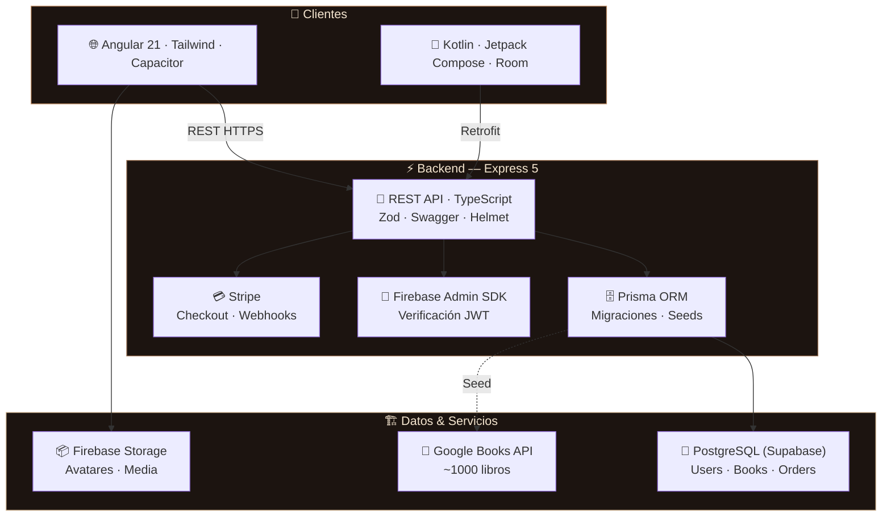

<div align="center">


<br/>

<picture>
  <source media="(prefers-color-scheme: dark)" srcset="https://readme-typing-svg.demolab.com?font=EB+Garamond&weight=500&size=24&duration=3500&pause=800&color=E8C9A0&center=true&vCenter=true&repeat=true&width=720&height=50&lines=%F0%9F%93%9A+Plataforma+de+compra+y+trueque+de+libros;%E2%9A%A1+Angular+21+%C2%B7+Kotlin+%C2%B7+Express+5+%C2%B7+PostgreSQL;%F0%9F%94%A5+Firebase+Auth+%C2%B7+Stripe+Payments+%C2%B7+Capacitor;%F0%9F%93%96+Tu+pr%C3%B3ximo+libro+te+est%C3%A1+buscando">
  
</picture>

<br/><br/>

<a href="https://github.com/Sergiibut05/BookMatch-Proyecto-Intermodular">
  
</a>
&nbsp;

&nbsp;

&nbsp;


<br/><br/>


</div>

<br/>

## ¿Qué es BookMatch?

**BookMatch** es una plataforma web y móvil donde los amantes de los libros pueden **comprar**, **vender** e **intercambiar** libros nuevos y usados. Combina un catálogo inteligente con trueque digital, pagos seguros con Stripe y recomendaciones personalizadas — todo en una experiencia multiplataforma con Angular y Kotlin nativo.

> *No es solo una tienda de libros. Es el punto de encuentro entre lectores, con un catálogo vivo y pagos integrados.*

<br/>

<div align="center"></div>

<br/>

## Funcionalidades

<table>
<tr>
<td width="50%">

**📖 Catálogo y descubrimiento**
- 📚 &nbsp;Catálogo de ~1000 libros reales (Google Books API)
- 🏷️ &nbsp;47 categorías con filtrado dinámico
- 🔍 &nbsp;Búsqueda y paginación de resultados
- 📄 &nbsp;Vista detallada con portada, precio, stock y categorías
- ⭐ &nbsp;Sistema de reseñas
- 🆕 &nbsp;Sección "Novedades" generada automáticamente

</td>
<td width="50%">

**💳 Compras y pagos**
- 🛒 &nbsp;Integración completa con Stripe Checkout
- 💰 &nbsp;Múltiples métodos: Card, Link, PayPal
- 📦 &nbsp;Dirección de envío obligatoria
- 🔐 &nbsp;3D Secure y PCI compliant
- 📋 &nbsp;Creación automática de órdenes
- 📉 &nbsp;Actualización automática de stock

</td>
</tr>
<tr>
<td width="50%">

**🔐 Autenticación y perfil**
- 🔥 &nbsp;Firebase Auth (email + Google OAuth)
- 🖼️ &nbsp;Foto de perfil con cámara o galería
- ☁️ &nbsp;Almacenamiento en Firebase Storage
- 🔄 &nbsp;Sincronización Auth ↔ PostgreSQL
- 🛡️ &nbsp;AuthGuard en rutas protegidas
- 📱 &nbsp;Navegación adaptativa (web / móvil)

</td>
<td width="50%">

**📱 Multiplataforma**
- 🌐 &nbsp;Web con Angular 21 (standalone + signals)
- 🤖 &nbsp;Android nativo con Kotlin + Jetpack Compose
- ⚡ &nbsp;Capacitor 7 para bridge nativo en web
- 💾 &nbsp;Room DB — offline-first en Android
- 🔗 &nbsp;Deep links: `bookmatch://payment/...`
- 🌍 &nbsp;i18n preparado con ngx-translate

</td>
</tr>
</table>

<br/>

<div align="center"></div>

<br/>

## Tech Stack

<div align="center">

**Frontend & Mobile**

<a href="https://skillicons.dev">
  
</a>

<br/><br/>

**Backend & Infrastructure**

<a href="https://skillicons.dev">
  
</a>

<br/><br/>

**Servicios & DevOps**

<a href="https://skillicons.dev">
  
</a>

</div>

<br/>

<details>
<summary><b>📋 Tabla completa del stack</b></summary>
<br/>

| Capa | Tecnología | Versión | Notas |
|---|---|---|---|
| **Web framework** | Angular | 21.x | Standalone · Signals · Zoneless |
| **UI** | Tailwind CSS | v4 | Dark mode · responsive · i18n |
| **Mobile** | Kotlin + Jetpack Compose | — | Material 3 · Hilt · Coil |
| **Bridge nativo** | Capacitor | 7.4 | Cámara · Storage · Deep links |
| **API** | Express | 5.x | ESM · Swagger · modular |
| **Validación** | Zod | 4.x | Esquemas tipados end-to-end |
| **ORM** | Prisma | 6.x | PostgreSQL · migraciones · seeds |
| **Base de datos** | PostgreSQL | — | Supabase hosted · N:M relations |
| **Caché local** | Room | — | Android offline-first |
| **Auth** | Firebase Auth | 11.x | JWT · OAuth · Admin SDK |
| **Media** | Firebase Storage | — | Avatares y fotos |
| **Pagos** | Stripe Checkout | — | Card · Link · PayPal · Webhooks |
| **HTTP cliente** | Retrofit + Gson | — | Android REST client |
| **DI** | Hilt (Android) | — | Módulos inyectados |
| **Seguridad** | Helmet + Rate Limit | — | CORS · headers seguros |
| **Logging** | Winston | 3.x | Logs estructurados |
| **Seeding** | Google Books API | — | ~1000 libros · 47 categorías |
| **Lenguaje** | TypeScript 5 strict | 5.x | Type safety end-to-end |

</details>

<br/>

<div align="center"></div>

<br/>

## Arquitectura

<div align="center">

</div>

<br/>



> **Multiplataforma.** Dos clientes (web + Android nativo) comparten el mismo backend REST. Firebase gestiona auth y media. Stripe procesa pagos de forma segura.

<br/>

<div align="center"></div>

<br/>

## Flujo de pagos

<div align="center">

</div>

<br/>

| Paso | Acción | Detalle |
|---|---|---|
| **1** | Usuario pulsa "Comprar" | En la vista de detalles del libro |
| **2** | Backend crea sesión | `POST /api/payments/create-checkout-session` |
| **3** | Redirect a Stripe | Checkout con datos del libro (nombre, precio, foto) |
| **4** | Pago procesado | Card, Link o PayPal — modo test configurado |
| **5** | Confirmación | Order creada en BD + stock decrementado |
| **6** | Deep link (Android) | `bookmatch://payment/success?session_id=...` |

<br/>

<details>
<summary><b>🧪 Tarjetas de prueba</b></summary>
<br/>

| Tarjeta | Resultado |
|---------|-----------|
| `4242 4242 4242 4242` | ✅ Pago exitoso |
| `4000 0000 0000 0002` | ❌ Rechazado |
| `4000 0025 0000 3155` | 🔐 Requiere 3D Secure |

Datos: cualquier fecha futura · CVC `123` · CP `12345`

</details>

<br/>

<div align="center"></div>

<br/>

## Repositorios

<div align="center">

| Repositorio | Descripción | Stack principal |
|---|---|---|
| [`BookMatch-Proyecto-Intermodular`](https://github.com/Sergiibut05/BookMatch-Proyecto-Intermodular) | 🏠 Monorepo principal (Web + Backend) | Angular 21 · Express 5 · Prisma · Firebase |
| [`BookMatch-Android`](https://github.com/SamuelMarquezRuiz/BookMatch-Android) | 🤖 App Android nativa | Kotlin · Jetpack Compose · Room · Hilt |

</div>

<br/>

<div align="center"></div>

<br/>

## Estructura del proyecto

<table>
<tr>
<td width="50%" valign="top">

**📁 Monorepo principal**
```
BookMatch-Proyecto-Intermodular/
├── BookMatch-Angular/          # Frontend web
│   └── src/app/
│       ├── core/               # Guards, services
│       ├── shared/             # Header, footer, models
│       └── features/           # Auth, home, book-details
│           ├── auth/           #   login, registro
│           ├── home/           #   catálogo + grid
│           ├── book-details/   #   detalles + compra
│           ├── categories/     #   filtrado
│           ├── payment-success/#   confirmación
│           └── profile/        #   perfil + foto
├── BookMatch-Backend/          # API REST
│   ├── src/
│   │   ├── config/             # Env, Prisma, Swagger
│   │   ├── middleware/         # Auth, rate limit
│   │   ├── modules/            # Negocio
│   │   │   ├── auth/
│   │   │   ├── users/
│   │   │   ├── catalog-books/
│   │   │   └── payments/       # Stripe
│   │   └── utils/              # Logger, Firebase
│   └── prisma/                 # Schema + migraciones
└── docs/
```

</td>
<td width="50%" valign="top">

**📁 App Android**
```
BookMatch-Android/
├── app/src/main/java/.../
│   ├── ui/                     # Compose screens
│   │   ├── home/               # Catálogo
│   │   ├── detail/             # Detalles libro
│   │   ├── cart/               # Carrito
│   │   ├── auth/               # Login/registro
│   │   └── profile/            # Perfil usuario
│   ├── data/
│   │   ├── local/              # Room DB + DAOs
│   │   ├── remote/             # Retrofit APIs
│   │   ├── repository/         # Repositorios
│   │   └── model/              # Entidades
│   └── di/                     # Hilt modules
├── build.gradle.kts
└── gradle/
```

</td>
</tr>
</table>

<br/>

<div align="center"></div>

<br/>

## Endpoints principales

<details>
<summary><b>🔐 Autenticación</b></summary>
<br/>

| Método | Ruta | Descripción | Auth |
|--------|------|-------------|------|
| POST | `/api/auth/register` | Sincroniza usuario Firebase | Token Firebase |
| POST | `/api/auth/login` | Valida y devuelve perfil | Token Firebase |

</details>

<details>
<summary><b>👤 Usuarios</b></summary>
<br/>

| Método | Ruta | Descripción | Auth |
|--------|------|-------------|------|
| GET | `/api/users/me` | Perfil del autenticado | ✅ |
| PATCH | `/api/users/me` | Actualizar perfil | ✅ |
| GET | `/api/users` | Lista usuarios | ✅ |
| GET | `/api/users/:id` | Obtener por ID | ✅ |
| PATCH | `/api/users/:id` | Actualizar | ✅ |
| DELETE | `/api/users/:id` | Eliminar | ✅ |

</details>

<details>
<summary><b>📚 Catálogo</b></summary>
<br/>

| Método | Ruta | Descripción | Auth |
|--------|------|-------------|------|
| GET | `/api/catalog-books` | Lista paginada + filtros | ✅ |
| GET | `/api/catalog-books/:id` | Detalle libro | ✅ |
| POST | `/api/catalog-books` | Crear libro | ✅ |
| PATCH | `/api/catalog-books/:id` | Actualizar | ✅ |
| DELETE | `/api/catalog-books/:id` | Eliminar | ✅ |

</details>

<details>
<summary><b>💳 Pagos (Stripe)</b></summary>
<br/>

| Método | Ruta | Descripción | Auth |
|--------|------|-------------|------|
| POST | `/api/payments/create-checkout-session` | Sesión individual | ✅ |
| POST | `/api/payments/create-checkout-session-cart` | Sesión carrito | ✅ |
| POST | `/api/payments/webhook` | Webhook Stripe | ❌ |
| GET | `/api/payments/success` | Verificar + crear Order | ✅ |
| GET | `/api/payments/session/:id` | Detalles sesión | ✅ |

</details>

<br/>

<div align="center"></div>

<br/>

## Desarrollo local

<details>
<summary><b>⚡ Backend — Express 5</b></summary>
<br/>

```bash
cd BookMatch-Backend
npm install

# Crear .env (ver env.production.example)
cp env.production.example .env

# Generar Prisma Client y migrar
npx prisma generate
npx prisma migrate deploy

# Seed del catálogo (~1000 libros)
npx tsx seed.ts

# Arrancar
npm run dev          # → http://localhost:3000
                     # Swagger: http://localhost:3000/api-docs
```
</details>

<details>
<summary><b>🌐 Frontend — Angular 21</b></summary>
<br/>

```bash
cd BookMatch-Angular
npm install

# Configurar src/environments/environment.ts
# (Firebase config + Stripe publishable key + API URL)

npm start            # → http://localhost:4200
```
</details>

<details>
<summary><b>🤖 Android — Kotlin</b></summary>
<br/>

```bash
# Abrir en Android Studio: BookMatch-Android/
# Sincronizar Gradle
# Asegurar app/google-services.json (Firebase)
# Run en emulador o dispositivo con Android 14+ (minSdk 34)
```
</details>

<details>
<summary><b>💳 Stripe CLI (Webhooks locales)</b></summary>
<br/>

```bash
# macOS
brew install stripe/stripe-cli/stripe

stripe login
stripe listen --forward-to localhost:3000/api/payments/webhook
# → copia el webhook secret a tu .env
```
</details>

<br/>

<div align="center"></div>

<br/>

## Actividad del proyecto

<div align="center">

</div>

<br/>

<div align="center"></div>

<br/>

## Seguridad

<div align="center">


&nbsp;

&nbsp;

&nbsp;

&nbsp;


</div>

<br/>

| Capa | Medida | Detalle |
|---|---|---|
| **Auth** | Firebase JWT | Tokens verificados en cada request |
| **OAuth** | Google Sign-In | Registro rápido y seguro |
| **API** | Middleware auth | Todas las rutas protegidas |
| **Headers** | Helmet | Seguridad HTTP estándar |
| **Abuso** | Rate limiting | Prevención de spam |
| **Datos** | Zod schemas | Validación tipada en entrada |
| **CORS** | Configurado | Orígenes permitidos explícitos |
| **Logs** | Winston | Registro estructurado de errores |
| **Secretos** | `.env` no versionado | Cada dev crea su propio `.env` |

<br/>

<div align="center"></div>

<br/>

## Roadmap

<div align="center">

```
  ✅ Fase 1 — Base                    ✅ Fase 2 — Core                     🔄 Fase 3 — Expansión
  ─────────────────                    ────────────────                     ──────────────────────
  • Repo + Firebase + PG              • Catálogo ~1000 libros              • Carrito de compras
  • Auth email + Google               • Stripe Checkout                    • Historial de pedidos
  • Esquema Prisma completo           • Perfil con fotos                   • Sistema de trueque
  • Middleware seguridad               • App Android nativa                 • Correos de confirmación
  • Swagger / OpenAPI                  • Room offline-first                 • Recomendaciones IA
```

</div>

<br/>

<div align="center"></div>

<br/>

## Equipo

<div align="center">

<table>
<tr>
  <td align="center" width="33%">
    <br/>
    <a href="https://github.com/Sergiibut05">
      
    </a>
    <br/><br/>
    <sub>Angular 21 · Express 5 · Prisma · Stripe</sub>
    <br/><br/>
  </td>
  <td align="center" width="33%">
    <br/>
    <a href="https://github.com/SamuelMarquezRuiz">
      
    </a>
    <br/><br/>
    <sub>Kotlin · Compose · Express · Room</sub>
    <br/><br/>
  </td>
  <td align="center" width="33%">
    <br/>
    
    <br/><br/>
    <sub>Figma · Angular · Testing · Documentación</sub>
    <br/><br/>
  </td>
</tr>
</table>

> *Aunque cada uno tenía un rol principal enfocado, **todos los miembros del equipo** han participado de forma transversal en el desarrollo, colaborando en tareas de front, back, bbdd y diseño según las necesidades del proyecto.*

<br/>

<sub>Hecho con 📚 por el equipo BookMatch · DAM Proyecto Intermodular · 2025</sub>

<br/><br/>


<br/>


</div>
